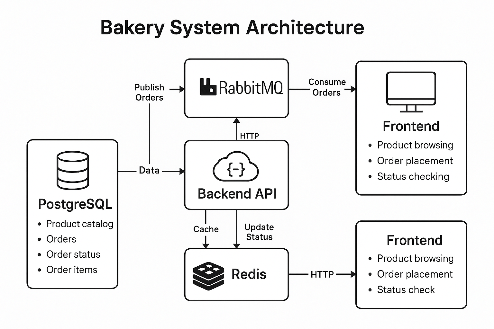

# Bakery-System
A containerized bakery management application built with Docker that allows customers to view products, place orders, and check order status.

## System Architecture Overview



The Bakery Management System follows a microservices architecture pattern with the following components:

### 1. PostgreSQL Database
- **Purpose**: Central data storage for the application
- **Implementation**: Official PostgreSQL 13 Docker image
- **Configuration**:
  - Persistent volume for data storage
  - Initialization script for schema and sample data
  - Environment variables for database credentials
- **Responsibilities**:
  - Stores product catalog information
  - Maintains customer order records
  - Tracks order statuses
  - Stores order item details

### 2. Backend API Service
- **Purpose**: Provides RESTful API endpoints for accessing and manipulating data
- **Implementation**: Python Flask application
- **Architecture**:
  - RESTful API design
  - Connection pooling for database access
  - Message publishing to RabbitMQ
  - Redis cache integration
- **Key Features**:
  - Product catalog endpoint
  - Order placement processing
  - Order status retrieval
  - Health check monitoring

### 3. Frontend Web Application
- **Purpose**: User interface for customer interaction
- **Implementation**: React.js SPA served by Nginx
- **Features**:
  - Product browsing with dynamic filtering
  - Shopping cart functionality
  - Checkout process
  - Order status tracking
  - Responsive design

### 4. RabbitMQ Message Queue
- **Purpose**: Asynchronous communication between services
- **Implementation**: RabbitMQ with management plugin
- **Configuration**:
  - Default exchange
  - Durable queues for message persistence
  - Message acknowledgment for reliability
- **Responsibilities**:
  - Decouples order creation from order processing
  - Enables asynchronous workflow
  - Provides message buffering during high load

### 5. Worker Service
- **Purpose**: Background processing of orders
- **Implementation**: Python service consuming from RabbitMQ
- **Features**:
  - Message acknowledgment
  - Error handling with retry logic
  - Order status updates
  - Simulated processing time

### 6. Redis Cache
- **Purpose**: Performance optimization through caching
- **Implementation**: Redis Alpine Docker image
- **Caching Strategy**:
  - Time-based expiration (TTL)
  - Cache invalidation on data changes
  - Graceful fallback to database on cache miss

### Container Networking
All services are connected via Docker's internal network, with specific port mappings for external access:
- Frontend: Port 80 (HTTP)
- Backend API: Port 5000
- RabbitMQ Management: Port 15672
- Other services: Internal access only

### Data Flow
1. Customers interact with the Frontend interface
2. Frontend communicates with Backend API
3. Backend retrieves/writes data to PostgreSQL
4. Product listings are cached in Redis
5. New orders are published to RabbitMQ
6. Worker consumes messages from RabbitMQ
7. Worker processes orders and updates status in database

## Setup Instructions

### Prerequisites
- **Docker**: Docker Desktop 4.0+ (Windows/Mac) or Docker Engine 20.10+ (Linux)
- **Docker Compose**: Version 2.0+ (included with Docker Desktop)
- **Disk Space**: At least 2GB free
- **Memory**: Minimum 4GB RAM allocated to Docker
- **Port Availability**: Ports 80, 5000, and 15672 must be free

### Installation Steps

1. **Clone the Repository**
   ```bash
   git clone https://github.com/yourusername/bakery-management-system.git
   cd bakery-management-system
   ```

2. **Configure Environment Variables (Optional)**
   You can modify the default configuration by creating a `.env` file in the project root:
   ```
   POSTGRES_USER=bakeryuser
   POSTGRES_PASSWORD=securepassword
   POSTGRES_DB=bakerydb
   ```

3. **Build and Start the Containers**
   ```bash
   docker-compose up -d
   ```
   This command builds all required images and starts the containers in detached mode.

4. **Verify Service Health**
   ```bash
   docker-compose ps
   ```
   All services should show a "running" state. Allow up to 30 seconds for all services to initialize properly.

5. **Access the Application**
   - Frontend Web Interface: http://localhost:80
   - Backend API: http://localhost:5000/api
   - RabbitMQ Management: http://localhost:15672 (username: guest, password: guest)

### Common Setup Issues

#### Database Connection Problems
If the backend can't connect to the database:
```bash
docker-compose logs backend
docker-compose logs db
```
Check that the database container is running and initialized properly.

#### Port Conflicts
If you see errors about ports being in use:
```bash
netstat -ano | findstr "80 5000 15672"
```
Identify and stop services using these ports, or modify the port mappings in docker-compose.yml.

### Stopping the Application

To stop all services while preserving data:
```bash
docker-compose down
```

To stop all services and remove volumes (ALL DATA WILL BE LOST):
```bash
docker-compose down -v
```

## API Documentation

The backend service exposes a RESTful API with the following endpoints:

### Health Check

**Endpoint:** `GET /health`

**Purpose:** Verify the API service is running and responsive

**Response:**
```json
{
  "status": "healthy"
}
```

**Status Codes:**
- `200`: Service is healthy
- `503`: Service is unhealthy

### Products API

#### List All Products

**Endpoint:** `GET /api/products`

**Purpose:** Retrieve all available bakery products

**Response:**
```json
[
  {
    "id": 1,
    "name": "Chocolate Cake",
    "description": "Rich chocolate cake with chocolate frosting",
    "price": 25.99,
    "in_stock": true
  },
  {
    "id": 2,
    "name": "Sourdough Bread",
    "description": "Artisanal sourdough bread",
    "price": 6.50,
    "in_stock": true
  }
]
```

**Status Codes:**
- `200`: Success
- `500`: Server error

#### Get Product by ID

**Endpoint:** `GET /api/products/{id}`

**Purpose:** Retrieve a specific product by ID

**Response:**
```json
{
  "id": 1,
  "name": "Chocolate Cake",
  "description": "Rich chocolate cake with chocolate frosting",
  "price": 25.99,
  "in_stock": true
}
```

**Status Codes:**
- `200`: Success
- `404`: Product not found
- `500`: Server error

### Orders API

#### Place an Order

**Endpoint:** `POST /api/orders`

**Purpose:** Submit a new order

**Request Body:**
```json
{
  "customer_name": "John Doe",
  "customer_email": "john@example.com",
  "items": [
    {
      "product_id": 1,
      "quantity": 2
    },
    {
      "product_id": 3,
      "quantity": 4
    }
  ]
}
```

**Response:**
```json
{
  "message": "Order placed successfully",
  "order_id": 123
}
```

**Status Codes:**
- `201`: Order created successfully
- `400`: Invalid request (missing required fields)
- `404`: Product not found
- `500`: Server error

**Validation Rules:**
- `customer_name`: Required, string, max length 100
- `customer_email`: Required, valid email format, max length 100
- `items`: Required, array with at least one item
- Each item must have:
  - `product_id`: Required, integer, must exist in products table
  - `quantity`: Required, integer, minimum 1

#### Check Order Status

**Endpoint:** `GET /api/orders/{order_id}`

**Purpose:** Retrieve the status of an existing order

**Response:**
```json
{
  "order_id": 123,
  "customer_name": "John Doe",
  "status": "completed",
  "created_at": "2023-04-20T14:30:45Z"
}
```

**Status Codes:**
- `200`: Success
- `404`: Order not found
- `500`: Server error

**Possible Status Values:**
- `pending`: Order received but not yet processed
- `processing`: Order is being prepared
- `completed`: Order is ready
- `cancelled`: Order was cancelled

### Error Responses

All API endpoints return a standardized error format:

```json
{
  "error": "Descriptive error message",
  "code": "ERROR_CODE"
}
```

**Common Error Codes:**
- `INVALID_INPUT`: Request validation failed
- `RESOURCE_NOT_FOUND`: The requested resource doesn't exist
- `DATABASE_ERROR`: Database operation failed
- `SERVICE_UNAVAILABLE`: Dependent service is not available

### API Usage Examples

#### cURL

List all products:
```bash
curl http://localhost:5000/api/products
```

Place an order:
```bash
curl -X POST http://localhost:5000/api/orders \
  -H "Content-Type: application/json" \
  -d '{
    "customer_name": "John Doe",
    "customer_email": "john@example.com",
    "items": [
      {
        "product_id": 1,
        "quantity": 2
      }
    ]
  }'
```

Check order status:
```bash
curl http://localhost:5000/api/orders/123
```

#### JavaScript (Fetch API)

```javascript
// List products
fetch('http://localhost:5000/api/products')
  .then(response => response.json())
  .then(data => console.log(data));

// Place order
fetch('http://localhost:5000/api/orders', {
  method: 'POST',
  headers: {
    'Content-Type': 'application/json',
  },
  body: JSON.stringify({
    customer_name: 'John Doe',
    customer_email: 'john@example.com',
    items: [
      {
        product_id: 1,
        quantity: 2
      }
    ]
  }),
})
.then(response => response.json())
.then(data => console.log(data));
```

### Rate Limiting

The API implements basic rate limiting to prevent abuse:
- 100 requests per minute per IP address
- Applies to all endpoints

When rate limit is exceeded, the API returns:
- Status code: `429 Too Many Requests`
- Headers: `Retry-After: <seconds>`

### API Security Considerations

This demo implementation focuses on functionality rather than security. In a production environment, consider implementing:
- HTTPS encryption
- Authentication (JWT, OAuth)
- More sophisticated rate limiting
- Input sanitization
- API versioning
